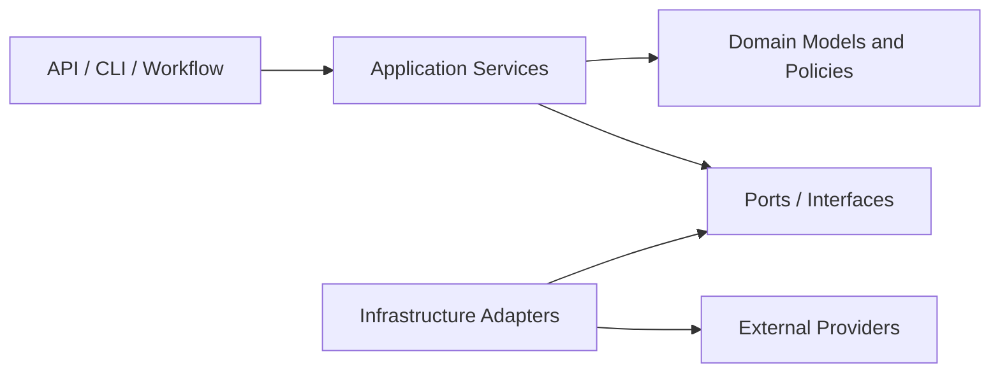
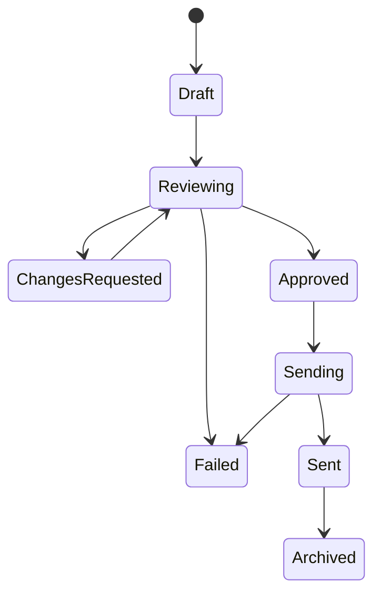
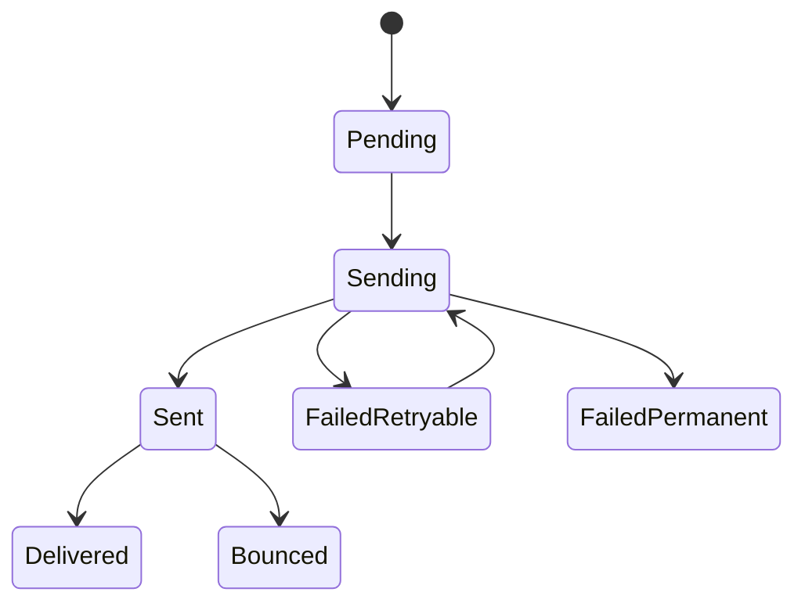
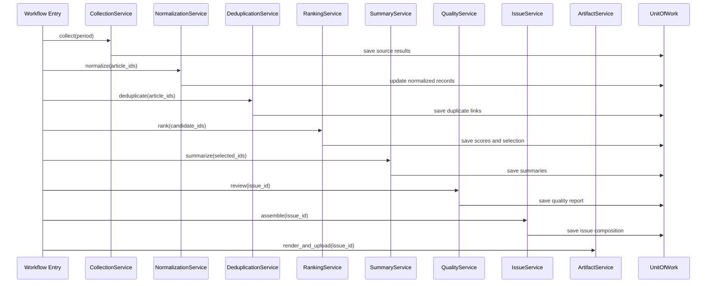
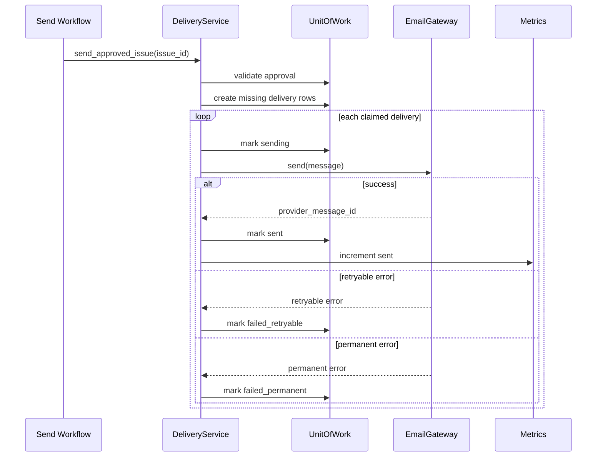

# 10_Low_Level_Architecture.md

# Low-Level Architecture

**Project:** Autonomous AI Intelligence Newsletter Platform  
**Document ID:** ARCH-010  
**Version:** 1.0  
**Status:** Low-Level Architecture Baseline  
**Author:** Karan  
**Last Updated:** July 2026  
**Audience:** Developer, reviewer, interviewer, future contributor

---

## 1. Purpose

This document translates the high-level architecture into an implementable internal software design.

It defines:

- the Python package structure;
- internal modules and responsibilities;
- public interfaces between modules;
- dependency direction;
- domain models;
- application services;
- infrastructure adapters;
- error contracts;
- configuration boundaries;
- transaction boundaries;
- logging conventions;
- extension points;
- testing seams;
- low-level execution flows.

This document does not define final database columns, exact API schemas, prompt wording, or LangGraph node implementations. Those details belong in later specialized documents.

---

## 2. Low-Level Design Principles

The codebase shall follow these principles:

1. **Separation of concerns:** collection, ranking, summarization, rendering, storage, and delivery remain separate.
2. **Dependency inversion:** application logic depends on interfaces, not concrete providers.
3. **Thin orchestration nodes:** LangGraph nodes coordinate services rather than contain complex business logic.
4. **Explicit contracts:** inputs and outputs use typed Pydantic/domain models.
5. **Small state:** workflow state contains identifiers and compact metadata.
6. **Deterministic core:** filtering, normalization, scoring, idempotency, and status transitions are deterministic.
7. **Side-effect isolation:** provider calls, file writes, database writes, and email sending live behind adapters.
8. **Transaction awareness:** multi-step state changes are grouped into clear transaction boundaries.
9. **Idempotency by design:** repeat execution is safe.
10. **Testability:** each module can be replaced with a fake or mock.
11. **Observability:** logs and metrics include stable identifiers.
12. **Configuration validation:** invalid configuration fails before external work starts.

---

## 3. Proposed Repository Structure

```text
ai-intelligence-newsletter/
├── .github/
│   └── workflows/
│       ├── ci.yml
│       ├── generate-newsletter.yml
│       ├── send-newsletter.yml
│       └── maintenance.yml
│
├── src/
│   └── ai_newsletter/
│       ├── __init__.py
│       ├── main.py
│       ├── cli.py
│       ├── config.py
│       ├── constants.py
│       │
│       ├── domain/
│       │   ├── __init__.py
│       │   ├── enums.py
│       │   ├── models.py
│       │   ├── value_objects.py
│       │   ├── policies.py
│       │   └── exceptions.py
│       │
│       ├── application/
│       │   ├── __init__.py
│       │   ├── services/
│       │   │   ├── collection_service.py
│       │   │   ├── normalization_service.py
│       │   │   ├── filtering_service.py
│       │   │   ├── deduplication_service.py
│       │   │   ├── ranking_service.py
│       │   │   ├── summary_service.py
│       │   │   ├── quality_service.py
│       │   │   ├── issue_service.py
│       │   │   ├── artifact_service.py
│       │   │   ├── approval_service.py
│       │   │   └── delivery_service.py
│       │   ├── commands/
│       │   ├── queries/
│       │   └── dto.py
│       │
│       ├── ports/
│       │   ├── collectors.py
│       │   ├── repositories.py
│       │   ├── llm.py
│       │   ├── object_store.py
│       │   ├── email_gateway.py
│       │   ├── clock.py
│       │   └── id_generator.py
│       │
│       ├── infrastructure/
│       │   ├── database/
│       │   │   ├── engine.py
│       │   │   ├── session.py
│       │   │   ├── models.py
│       │   │   ├── repositories/
│       │   │   └── unit_of_work.py
│       │   ├── collectors/
│       │   │   ├── base.py
│       │   │   ├── arxiv.py
│       │   │   ├── github.py
│       │   │   ├── huggingface.py
│       │   │   └── rss.py
│       │   ├── llm/
│       │   │   ├── grok_client.py
│       │   │   ├── schemas.py
│       │   │   └── cache.py
│       │   ├── storage/
│       │   │   └── r2_store.py
│       │   ├── email/
│       │   │   ├── resend_gateway.py
│       │   │   └── webhook_verifier.py
│       │   ├── rendering/
│       │   │   ├── html_renderer.py
│       │   │   └── pdf_renderer.py
│       │   └── observability/
│       │       ├── logging.py
│       │       ├── metrics.py
│       │       └── tracing.py
│       │
│       ├── workflow/
│       │   ├── graph.py
│       │   ├── state.py
│       │   ├── nodes.py
│       │   ├── routes.py
│       │   ├── checkpoints.py
│       │   └── policies.py
│       │
│       ├── api/
│       │   ├── app.py
│       │   ├── dependencies.py
│       │   ├── routes/
│       │   │   ├── subscribers.py
│       │   │   ├── issues.py
│       │   │   ├── approvals.py
│       │   │   └── webhooks.py
│       │   └── schemas.py
│       │
│       ├── templates/
│       │   ├── newsletter.html.j2
│       │   ├── verification.html.j2
│       │   └── unsubscribe.html.j2
│       │
│       └── utils/
│           ├── hashing.py
│           ├── urls.py
│           ├── text.py
│           └── time.py
│
├── migrations/
├── tests/
│   ├── unit/
│   ├── integration/
│   ├── e2e/
│   └── fixtures/
├── scripts/
├── docs/
├── sample_output/
├── docker-compose.yml
├── pyproject.toml
├── .env.example
├── README.md
└── plan.md
```

---

## 4. Dependency Direction

The codebase follows an inward dependency rule.



### Allowed dependencies

- `api` may depend on `application`, `domain`, and `ports`.
- `workflow` may depend on `application`, `domain`, and `ports`.
- `application` may depend on `domain` and `ports`.
- `infrastructure` may depend on `ports` and `domain`.
- `domain` must not depend on infrastructure, FastAPI, SQLAlchemy, Resend, R2, or xAI SDKs.

### Forbidden dependencies

- Domain models importing SQLAlchemy models
- Ranking service importing Resend
- Collector importing rendering code
- LLM adapter updating database status directly
- Workflow node issuing raw SQL
- API route containing business rules
- Repository deciding approval policy
- Renderer calculating ranking scores

---

## 5. Domain Layer

The domain layer contains the core concepts and business rules.

### 5.1 Main domain entities

- `Subscriber`
- `Source`
- `Article`
- `ArticleMetric`
- `StoryCluster`
- `NewsletterIssue`
- `NewsletterArticle`
- `WorkflowRun`
- `ApprovalDecision`
- `EmailDelivery`
- `PromptVersion`
- `RankingConfiguration`

### 5.2 Value objects

Value objects represent immutable concepts:

```python
@dataclass(frozen=True)
class ReportingPeriod:
    start: datetime
    end: datetime

@dataclass(frozen=True)
class CanonicalUrl:
    value: str

@dataclass(frozen=True)
class ContentHash:
    value: str

@dataclass(frozen=True)
class IssueKey:
    value: str
```

### 5.3 Domain enums

```python
class IssueStatus(StrEnum):
    DRAFT = "draft"
    REVIEWING = "reviewing"
    CHANGES_REQUESTED = "changes_requested"
    APPROVED = "approved"
    SENDING = "sending"
    SENT = "sent"
    FAILED = "failed"
    ARCHIVED = "archived"
```

Other enums:

- `SubscriberStatus`
- `DeliveryStatus`
- `WorkflowStatus`
- `ApprovalStatus`
- `SourceType`
- `ArticleCategory`
- `ErrorSeverity`
- `ReviewAction`

### 5.4 Domain policies

Examples:

- `IssuePublicationPolicy`
- `SubscriberEligibilityPolicy`
- `DeliveryRetryPolicy`
- `QualityThresholdPolicy`
- `SourceCoveragePolicy`
- `BudgetPolicy`
- `RevisionLimitPolicy`

A policy object must be deterministic and easy to test.

---

## 6. Application Layer

The application layer coordinates use cases.

It contains no framework-specific code.

### 6.1 CollectionService

Responsibilities:

- load enabled sources;
- invoke collectors;
- apply source-level retry policy;
- aggregate successes and failures;
- persist normalized source metadata;
- return a collection summary.

Input:

```python
CollectionRequest(
    run_id,
    reporting_period,
    enabled_source_ids
)
```

Output:

```python
CollectionResult(
    article_ids,
    successful_sources,
    failed_sources,
    warnings
)
```

### 6.2 NormalizationService

Responsibilities:

- validate external records;
- canonicalize URLs;
- normalize timestamps;
- clean text;
- compute hashes;
- convert to domain entities;
- persist exclusion reasons.

### 6.3 FilteringService

Responsibilities:

- date-window filtering;
- language filtering;
- source-policy filtering;
- topic relevance filtering;
- minimum-quality thresholds;
- recent-publication overlap filtering.

### 6.4 DeduplicationService

Responsibilities:

- exact ID matching;
- URL matching;
- title normalization;
- hash comparison;
- fuzzy similarity;
- semantic comparison through a separate optional port;
- story-cluster creation.

### 6.5 RankingService

Responsibilities:

- calculate ranking features;
- apply versioned weights;
- enforce section quotas;
- persist score components;
- return selected candidates.

### 6.6 SummaryService

Responsibilities:

- build evidence bundles;
- select prompt version;
- check summary cache;
- call LLM adapter;
- validate output;
- track usage;
- retry according to policy;
- persist summary.

### 6.7 QualityService

Responsibilities:

- deterministic checks;
- optional LLM-assisted review;
- issue quality score;
- revision recommendations;
- route recommendation.

### 6.8 IssueService

Responsibilities:

- create issue;
- enforce unique issue key;
- assemble issue sections;
- manage status transitions;
- create issue versions;
- validate publication readiness.

### 6.9 ArtifactService

Responsibilities:

- render HTML;
- render PDF;
- validate artifacts;
- upload to object storage;
- persist object keys and checksums.

### 6.10 ApprovalService

Responsibilities:

- validate reviewer;
- load current issue version;
- persist decision;
- update issue state;
- emit approval event.

### 6.11 DeliveryService

Responsibilities:

- validate issue approval;
- create missing delivery rows;
- load eligible recipients;
- rate-limit batches;
- send messages;
- persist provider results;
- retry failed recipients only;
- finalize issue delivery status.

---

## 7. Ports and Interfaces

Ports define the stable contracts between application logic and infrastructure.

## 7.1 Collector port

```python
class Collector(Protocol):
    source_name: str

    async def fetch(
        self,
        period: ReportingPeriod,
        cursor: str | None = None
    ) -> CollectorResult:
        ...
```

## 7.2 Repository ports

```python
class ArticleRepository(Protocol):
    async def upsert_many(self, articles: list[Article]) -> list[str]: ...
    async def get_by_ids(self, ids: list[str]) -> list[Article]: ...
    async def find_by_canonical_url(self, url: CanonicalUrl) -> Article | None: ...

class IssueRepository(Protocol):
    async def create_or_get(self, issue: NewsletterIssue) -> NewsletterIssue: ...
    async def transition_status(
        self,
        issue_id: str,
        expected: IssueStatus,
        target: IssueStatus
    ) -> None: ...
```

## 7.3 LLM port

```python
class Summarizer(Protocol):
    async def summarize(
        self,
        evidence: EvidenceBundle,
        prompt: PromptDefinition
    ) -> SummaryResult:
        ...
```

## 7.4 Object-storage port

```python
class ObjectStore(Protocol):
    async def put(
        self,
        key: str,
        payload: bytes,
        content_type: str,
        checksum: str
    ) -> StoredObject:
        ...

    async def exists(self, key: str) -> bool: ...
    async def signed_url(self, key: str, ttl_seconds: int) -> str: ...
```

## 7.5 Email-gateway port

```python
class EmailGateway(Protocol):
    async def send(self, message: OutboundMessage) -> ProviderMessageResult: ...
```

## 7.6 Unit-of-work port

```python
class UnitOfWork(Protocol):
    articles: ArticleRepository
    issues: IssueRepository
    deliveries: DeliveryRepository

    async def __aenter__(self): ...
    async def __aexit__(self, exc_type, exc, tb): ...
    async def commit(self): ...
    async def rollback(self): ...
```

---

## 8. Infrastructure Layer

The infrastructure layer implements ports.

### 8.1 Database adapters

Responsibilities:

- SQLAlchemy models;
- repository implementations;
- connection/session management;
- transaction handling;
- migration compatibility;
- query optimization;
- row-to-domain mapping.

### 8.2 Collector adapters

Each source adapter owns:

- authentication;
- endpoint construction;
- pagination;
- rate-limit parsing;
- source response mapping;
- source-specific retry classification.

### 8.3 Grok adapter

Owns:

- API authentication;
- model request construction;
- structured output parsing;
- provider error mapping;
- usage extraction;
- response timeout;
- provider-specific rate-limit handling.

### 8.4 R2 adapter

Owns:

- S3-compatible client;
- bucket/key operations;
- upload metadata;
- checksum validation;
- signed URLs;
- retryable storage errors.

### 8.5 Resend adapter

Owns:

- sender identity;
- request payload;
- provider message ID;
- error translation;
- webhook signature verification.

### 8.6 Rendering adapters

#### HTML renderer

- Jinja2 environment;
- template version;
- autoescaping;
- link rendering;
- issue view model.

#### PDF renderer

- Playwright browser lifecycle;
- print media configuration;
- page format;
- rendering timeout;
- PDF validation.

---

## 9. Workflow Layer

The workflow layer adapts application services into LangGraph nodes.

### 9.1 Thin-node rule

A node should:

1. read state identifiers;
2. call one application service;
3. store small result metadata;
4. return state updates;
5. raise typed errors when needed.

A node should not contain:

- large SQL queries;
- source parsing;
- prompt-building logic;
- HTML templates;
- email loops;
- ranking formula implementation.

### 9.2 Example node

```python
async def summarize_node(
    state: NewsletterState,
    services: ServiceContainer
) -> dict:
    result = await services.summary.summarize_pending(
        issue_id=state["issue_id"],
        article_ids=state["selected_article_ids"]
    )

    return {
        "completed_summary_ids": result.completed_ids,
        "failed_summary_ids": result.failed_ids,
        "current_stage": "summary_review"
    }
```

### 9.3 Routing functions

Routing functions must be pure where possible.

```python
def route_after_quality(state: NewsletterState) -> str:
    report = state["quality_report"]

    if report["approved"]:
        return "render"

    if report["retryable"] and state["retry_counts"]["quality"] < 2:
        return "revise"

    return "human_review"
```

---

## 10. API Layer

The API layer is optional for the first local automation but required for public subscription and browser approval.

### 10.1 Route groups

- `/subscribers`
- `/verification`
- `/unsubscribe`
- `/issues`
- `/admin/approvals`
- `/webhooks/resend`
- `/health`
- `/ready`

### 10.2 API route responsibilities

Routes may:

- parse requests;
- validate DTOs;
- call application services;
- map domain errors to HTTP responses;
- return response schemas.

Routes must not:

- contain SQL;
- call Resend directly;
- calculate ranking;
- modify workflow checkpoints manually;
- expose stack traces or secrets.

### 10.3 Dependency injection

FastAPI dependencies provide:

- authenticated reviewer;
- unit of work;
- application service container;
- configuration;
- request ID;
- logger.

---

## 11. Configuration Design

Use a validated configuration model.

```python
class Settings(BaseSettings):
    environment: Literal["development", "staging", "production"]

    database_url: SecretStr
    xai_api_key: SecretStr
    resend_api_key: SecretStr

    r2_endpoint: str
    r2_bucket: str
    r2_access_key: SecretStr
    r2_secret_key: SecretStr

    max_llm_cost_per_run: Decimal
    max_summary_retries: int = 2
    max_source_retries: int = 3
```

### Configuration precedence

1. explicit environment variables;
2. environment-specific configuration;
3. safe defaults;
4. no hidden fallback for secrets.

### Fail-fast rules

Startup fails when:

- database URL missing;
- production email key missing;
- production domain not configured;
- invalid retry limits;
- unsupported environment;
- bucket missing;
- cost limit negative.

---

## 12. Error Architecture

Errors are categorized by behavior.

### 12.1 Retryable external errors

- network timeout;
- temporary 5xx;
- rate limit;
- transient database connection failure;
- temporary browser failure.

### 12.2 Permanent external errors

- invalid API key;
- unauthorized sender;
- invalid recipient;
- unsupported request;
- missing source permission.

### 12.3 Domain errors

- unapproved issue;
- invalid status transition;
- duplicate issue key;
- subscriber not eligible;
- revision limit exceeded;
- insufficient source coverage.

### 12.4 Validation errors

- malformed source record;
- malformed LLM JSON;
- missing citation;
- invalid template data;
- invalid webhook signature.

### 12.5 Error contract

Each application-level error should expose:

```python
class AppError(Exception):
    code: str
    retryable: bool
    severity: ErrorSeverity
    public_message: str
    internal_message: str
    context: dict[str, Any]
```

### 12.6 Error translation

Infrastructure exceptions must be translated.

Example:

```text
httpx.ReadTimeout
    ↓
ExternalTemporaryError(code="GITHUB_TIMEOUT")
```

Application code should not depend on provider-specific exception types.

---

## 13. Transaction Boundaries

Transactions should be short and explicit.

### 13.1 Collection transaction

Persist normalized articles and source-fetch metadata in one or several bounded batches.

### 13.2 Issue creation transaction

Create or retrieve issue using unique issue key.

### 13.3 Approval transaction

- verify current version;
- insert approval record;
- transition issue state;
- commit atomically.

### 13.4 Delivery preparation transaction

- verify issue approved;
- create missing delivery rows;
- commit before external email calls.

### 13.5 Sending transaction rule

Do not keep a database transaction open while waiting for the external email API.

Recommended flow:

1. claim a delivery row;
2. commit claim;
3. call provider;
4. update result in a new transaction.

---

## 14. Concurrency Control

### 14.1 Workflow concurrency

GitHub Actions uses a concurrency group based on workflow and reporting period.

### 14.2 Issue-level lock

The database prevents two processes from simultaneously changing the same issue into `sending`.

Options:

- optimistic status transition with expected previous state;
- row-level lock;
- advisory lock.

### 14.3 Delivery claim

A worker claims only rows currently eligible for sending.

Possible pattern:

```sql
SELECT ...
FOR UPDATE SKIP LOCKED
```

This becomes more useful if email sending later uses multiple workers.

### 14.4 Summary concurrency

Use bounded async concurrency to avoid rate-limit and cost spikes.

---

## 15. Status Transition Design

### 15.1 Issue transitions



Invalid transitions must raise a domain error.

### 15.2 Delivery transitions



---

## 16. DTO and Schema Boundaries

Use different models for different layers.

### External DTO

Represents provider response.

### Domain model

Represents business concept.

### Persistence model

Represents database row.

### API schema

Represents public HTTP contract.

### Workflow state

Represents orchestration metadata.

These should not be collapsed into one universal model.

Example:

```text
GitHubRepositoryResponse
    ↓ mapper
CollectedItem
    ↓ normalizer
Article
    ↓ repository mapper
ArticleRow
```

---

## 17. Mapping Strategy

Mappers must be explicit.

```python
def article_row_to_domain(row: ArticleRow) -> Article:
    ...

def article_to_row_values(article: Article) -> dict:
    ...

def source_dto_to_collected_item(dto: SourceDto) -> CollectedItem:
    ...
```

Benefits:

- provider schema changes remain isolated;
- database schema changes remain isolated;
- domain logic stays clean;
- tests become easier.

---

## 18. Service Container

Application entry points need a composition root.

```python
@dataclass
class ServiceContainer:
    collection: CollectionService
    normalization: NormalizationService
    filtering: FilteringService
    deduplication: DeduplicationService
    ranking: RankingService
    summary: SummaryService
    quality: QualityService
    issue: IssueService
    artifact: ArtifactService
    approval: ApprovalService
    delivery: DeliveryService
```

Only the composition root constructs concrete adapters.

Example entry points:

- CLI generation command;
- GitHub Actions command;
- FastAPI startup;
- tests.

---

## 19. Command and Query Separation

### Commands

Commands change state.

Examples:

- `GenerateIssue`
- `ApproveIssue`
- `RequestChanges`
- `SendIssue`
- `SubscribeUser`
- `UnsubscribeUser`

### Queries

Queries read state.

Examples:

- `GetIssuePreview`
- `ListPendingApprovals`
- `GetRunStatus`
- `GetDeliverySummary`

Full CQRS infrastructure is unnecessary, but separating write use cases from read use cases improves clarity.

---

## 20. Logging Conventions

Use structured logs.

### Required fields

- timestamp;
- level;
- event;
- environment;
- run ID;
- issue ID;
- component;
- operation;
- duration;
- attempt;
- error code.

### Prohibited fields

- API keys;
- full subscriber email lists;
- raw authorization headers;
- verification tokens;
- unsubscribe tokens;
- full LLM prompts when they contain sensitive data.

### Event naming

Use consistent snake_case:

- `collection_started`
- `collector_completed`
- `summary_validation_failed`
- `artifact_uploaded`
- `approval_recorded`
- `delivery_failed`

---

## 21. Metrics Interface

Application services should emit metrics through an abstraction.

```python
class Metrics(Protocol):
    def increment(self, name: str, value: int = 1, **tags): ...
    def observe(self, name: str, value: float, **tags): ...
```

This avoids coupling the application to a monitoring vendor.

---

## 22. Testing Architecture

### 22.1 Unit tests

Test pure logic:

- URL canonicalization;
- title normalization;
- scoring;
- filtering;
- status transitions;
- retry policy;
- eligibility policy;
- quality thresholds.

### 22.2 Application-service tests

Use fake ports:

- fake repositories;
- fake collector;
- fake LLM;
- fake object store;
- fake email gateway.

### 22.3 Integration tests

Test:

- SQLAlchemy repositories;
- migrations;
- R2 adapter;
- Grok adapter;
- Resend adapter;
- Playwright rendering.

### 22.4 Workflow tests

Test routing with deterministic fake services.

### 22.5 End-to-end tests

Run:

```text
mock sources
→ generate
→ approve
→ send to test recipient
```

---

## 23. Example Generation Call Flow



---

## 24. Example Sending Call Flow



---

## 25. Extension Points

### Add a new collector

Implement `Collector`, register it, provide source config, and add tests.

### Add a new LLM provider

Implement `Summarizer` and provider error mapping.

### Add a new object store

Implement `ObjectStore`.

### Add a new email provider

Implement `EmailGateway`.

### Add a new ranking feature

Implement feature calculator and version ranking configuration.

### Add another approval channel

Call `ApprovalService` from Slack, Telegram, or another UI.

---

## 26. Anti-Patterns to Avoid

- One `main.py` containing all logic
- Global mutable database session
- Provider SDK calls from domain logic
- Raw dictionaries passed everywhere
- Silent exception swallowing
- Unlimited retries
- Long database transactions around network calls
- LLM-generated SQL or direct production actions
- Storing full source documents in workflow state
- Reusing production subscriber data in tests
- Hard-coded ranking weights
- Hard-coded secrets
- Direct status updates without transition validation
- Sending before delivery row creation
- Marking issue sent before recipient results are known

---

## 27. Low-Level Acceptance Criteria

This architecture is correctly implemented when:

- package boundaries match dependency rules;
- domain code imports no provider SDK;
- application services can run with fake adapters;
- workflow nodes remain thin;
- provider exceptions are translated;
- invalid status transitions fail;
- transactions do not span external network calls;
- configuration is validated at startup;
- structured logs include run and issue IDs;
- every external provider can be replaced through an interface;
- unit tests cover core policies;
- database repositories pass integration tests;
- repeated execution remains idempotent.

---

## 28. Interview Questions

### Design

1. Why use dependency inversion?
2. Why separate domain and persistence models?
3. Why not pass dictionaries everywhere?
4. What belongs in an application service?
5. What belongs in a repository?
6. Why should LangGraph nodes be thin?
7. Why use a modular monolith?
8. How would you add another LLM provider?
9. How would you add a new source?
10. Why use a composition root?

### Reliability

11. Why should a database transaction not remain open during an API call?
12. How are provider errors normalized?
13. How do status transitions prevent invalid behavior?
14. How do you claim deliveries safely?
15. Why is bounded concurrency important?
16. What happens if two send workflows start?
17. Why are idempotency checks required at the database level?

### Testing

18. Which components can be unit tested without the internet?
19. How do fake ports improve testing?
20. What is the difference between an integration and end-to-end test?
21. How do you test workflow routing?
22. How do you mock Grok?
23. How do you test Resend without sending real email?

### Maintainability

24. Why separate provider DTOs from domain entities?
25. How do explicit mappers help?
26. When would you split the modular monolith?
27. Which module is likely to change most often?
28. How do you prevent circular dependencies?
29. Why version prompts and ranking configurations?
30. How does the design support future personalization?

---

## 29. Review Checklist

### Structure

- [ ] Domain layer has no infrastructure dependencies.
- [ ] Application services own use cases.
- [ ] Ports define external boundaries.
- [ ] Infrastructure implements ports.
- [ ] Workflow nodes call services.
- [ ] API routes remain thin.

### Reliability

- [ ] Provider errors are translated.
- [ ] Retry behavior is explicit.
- [ ] Transactions are bounded.
- [ ] Status transitions are validated.
- [ ] Idempotency is enforced.
- [ ] Concurrency control is defined.

### Testability

- [ ] External services can be faked.
- [ ] Core policies are pure.
- [ ] Mapping functions are testable.
- [ ] Database code is integration-tested.
- [ ] Workflow routing can run deterministically.

---

## 30. Dependencies on Other Documents

Depends on:

- `09_High_Level_Architecture.md`
- `03_Product_Requirements.md`

Expanded by:

- `11_Component_Architecture.md`
- `12_Data_Flow.md`
- `13_Deployment_Architecture.md`
- `14_Technology_Stack.md`
- `15_Design_Decisions.md`
- database, ingestion, LLM, and workflow documents.

---

## 31. Final Low-Level Architecture Statement

The application shall be implemented as a modular Python system with a clean domain core,
application services, explicit ports, provider adapters, thin workflow nodes, and thin API routes.
Business rules remain deterministic and testable. External side effects are isolated behind
interfaces. Database transactions are short, state transitions are validated, provider failures
are normalized, and idempotency is enforced at both application and database levels.

This structure provides enough rigor for a production-style project without introducing the
operational overhead of microservices before the workload requires them.
