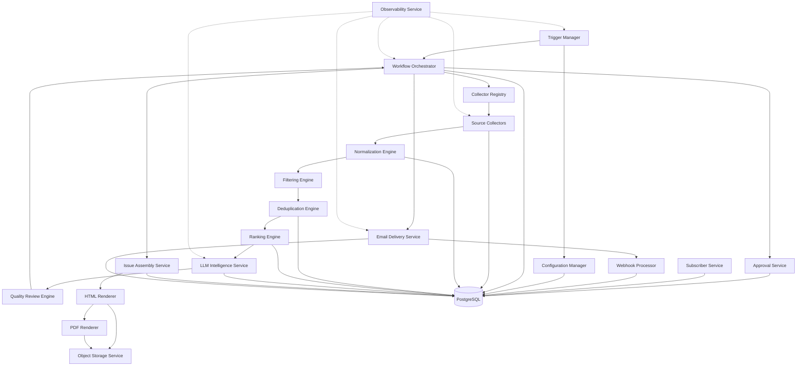

# 11_Component_Architecture.md

# Component Architecture

**Project:** Autonomous AI Intelligence Newsletter Platform  
**Document ID:** ARCH-011  
**Version:** 1.0  
**Status:** Component Architecture Baseline  
**Author:** Karan  
**Last Updated:** July 2026  
**Audience:** Developer, reviewer, interviewer, future contributor

---

## 1. Purpose

This document defines the internal and external components of the Autonomous AI Intelligence Newsletter Platform.

For each component, it explains:

- responsibility;
- owned data and state;
- inputs and outputs;
- dependencies;
- public contracts;
- failure modes;
- retry behavior;
- observability requirements;
- scaling considerations;
- security concerns;
- testing strategy.

This document builds on:

- `09_High_Level_Architecture.md`
- `10_Low_Level_Architecture.md`

The purpose is to make component boundaries concrete enough that implementation can proceed without mixing responsibilities.

---

## 2. Component Design Principles

Every component should satisfy the following principles:

1. It has one primary responsibility.
2. Its dependencies are explicit.
3. Its public contract is typed.
4. It does not directly control unrelated subsystems.
5. Its side effects are isolated.
6. Its failures are classified.
7. Its important operations are observable.
8. It can be tested independently.
9. It can be replaced without rewriting the whole application.
10. It does not silently violate workflow invariants.

---

## 3. Component Map



---

# 4. Trigger Manager

## 4.1 Responsibility

The Trigger Manager initiates generation, sending, maintenance, and recovery operations.

## 4.2 Trigger types

- scheduled weekly generation;
- manual generation;
- approved-issue sending;
- maintenance/cleanup;
- manual retry/recovery;
- future external API trigger.

## 4.3 Inputs

- reporting period;
- issue identifier;
- environment;
- manual options;
- retry flags;
- dry-run flag.

## 4.4 Outputs

- validated execution command;
- run identifier;
- issue key;
- trigger metadata.

## 4.5 Dependencies

- configuration manager;
- workflow orchestrator;
- observability service.

## 4.6 Invariants

- The same reporting period must map to the same issue key.
- Public sending cannot be triggered without issue ID.
- Manual trigger input must be validated.
- Trigger metadata must be recorded.

## 4.7 Failure modes

| Failure | Behavior |
|---|---|
| Invalid reporting period | Reject immediately |
| Missing production secret | Fail before workflow starts |
| Duplicate active run | Skip or attach to existing run |
| Unsupported command | Reject |
| Scheduler delay | Use intended period, not actual start time |

## 4.8 Metrics

- trigger count by type;
- trigger delay;
- skipped duplicate runs;
- manual versus scheduled execution;
- failed startup count.

## 4.9 Testing

- issue key generation;
- duplicate trigger handling;
- malformed manual input;
- dry-run mode;
- environment restrictions.

---

# 5. Configuration Manager

## 5.1 Responsibility

Loads, validates, and exposes configuration.

## 5.2 Configuration categories

- environment settings;
- provider secrets;
- source configuration;
- ranking weights;
- prompt/model configuration;
- retry limits;
- cost budgets;
- object-storage configuration;
- email sender configuration;
- feature flags.

## 5.3 Inputs

- environment variables;
- version-controlled config files;
- database configuration rows;
- secure secret storage.

## 5.4 Outputs

- immutable validated settings object;
- source-specific settings;
- feature configuration snapshots.

## 5.5 Dependencies

- secret source;
- database for runtime-configurable values;
- observability service.

## 5.6 Invariants

- No mandatory production setting may silently fall back.
- Secrets must not be serialized in logs.
- Ranking and prompt configuration must be versioned.
- Configuration snapshot used by a run must be reproducible.

## 5.7 Failure modes

- missing credentials;
- invalid bucket name;
- unsupported model;
- negative budget;
- invalid retry count;
- conflicting source settings.

## 5.8 Testing

- missing secret validation;
- environment override precedence;
- secret redaction;
- invalid enum values;
- configuration snapshot serialization.

---

# 6. Collector Registry

## 6.1 Responsibility

Maps configured sources to source-specific collector implementations.

## 6.2 Inputs

- enabled source definitions;
- source type;
- credentials/configuration;
- reporting period.

## 6.3 Outputs

- instantiated collectors;
- validation errors for unsupported sources.

## 6.4 Dependencies

- configuration manager;
- collector implementations;
- observability service.

## 6.5 Invariants

- Each source type has exactly one registered implementation.
- Disabled sources are never invoked.
- Unsupported source types fail visibly.
- Collector creation does not start network calls.

## 6.6 Extension model

Adding a new source requires:

1. implementing the collector interface;
2. registering the source type;
3. defining configuration schema;
4. adding fixtures and tests;
5. documenting rate limits and terms.

## 6.7 Testing

- source-to-collector mapping;
- disabled source handling;
- unsupported type;
- duplicate registration;
- invalid source configuration.

---

# 7. Source Collectors

## 7.1 Responsibility

Fetch source-specific records and map them to a common collected-item DTO.

## 7.2 Initial collectors

- arXiv collector;
- GitHub collector;
- Hugging Face collector;
- RSS collector;
- official blog collector;
- future community-signal collectors.

## 7.3 Inputs

- reporting period;
- source configuration;
- pagination cursor;
- rate-limit context.

## 7.4 Outputs

```python
CollectorResult(
    items: list[CollectedItem],
    next_cursor: str | None,
    rate_limit: RateLimitSnapshot | None,
    warnings: list[CollectorWarning]
)
```

## 7.5 Owned behavior

- endpoint construction;
- authentication;
- pagination;
- request timeout;
- provider response parsing;
- provider-specific error classification;
- rate-limit header extraction.

## 7.6 Forbidden behavior

Collectors must not:

- decide final inclusion;
- calculate final ranking;
- call the LLM;
- send email;
- render output;
- update issue approval;
- write arbitrary provider payloads to workflow state.

## 7.7 Failure modes

| Failure | Classification |
|---|---|
| Timeout | Retryable |
| HTTP 429 | Retryable with provider delay |
| HTTP 401/403 | Permanent configuration/security error |
| Malformed response | Validation/source error |
| Pagination loop | Defensive abort |
| Partial page failure | Continue or retry page |
| Provider schema change | Source adapter failure |

## 7.8 Retry behavior

- bounded retries;
- exponential backoff;
- jitter;
- respect `Retry-After`;
- no retries for permanent authentication errors;
- record attempt count.

## 7.9 Metrics

- requests;
- latency;
- items fetched;
- pages fetched;
- malformed items;
- retry count;
- rate-limit remaining;
- source success/failure.

## 7.10 Security

- validate returned URLs;
- limit response body size;
- prevent SSRF through configured endpoints;
- never execute fetched content;
- avoid storing unnecessary full payloads.

## 7.11 Testing

- fixture-based parsing;
- pagination;
- timeout;
- rate limit;
- malformed records;
- empty response;
- publication-window behavior.

---

# 8. Normalization Engine

## 8.1 Responsibility

Converts collected items into canonical internal article entities.

## 8.2 Inputs

- collected-item DTO;
- source metadata;
- normalization policy.

## 8.3 Outputs

- normalized `Article`;
- validation/exclusion result;
- normalization warnings.

## 8.4 Operations

- timestamp normalization to UTC;
- URL canonicalization;
- title cleanup;
- author normalization;
- whitespace and encoding cleanup;
- excerpt trimming;
- language detection;
- source type mapping;
- content hash generation;
- external ID normalization.

## 8.5 Invariants

Every accepted article has:

- source identity;
- title;
- canonical URL;
- publication timestamp;
- content hash;
- source type;
- normalized excerpt or metadata.

## 8.6 Failure modes

- unparseable timestamp;
- missing title;
- invalid URL;
- empty identifying content;
- unsupported language;
- oversized text;
- invalid encoding.

## 8.7 Metrics

- accepted count;
- rejected count;
- rejection reasons;
- normalization duration;
- language distribution;
- missing-field frequency.

## 8.8 Testing

- URL normalization;
- title normalization;
- timestamp conversion;
- Unicode handling;
- hash stability;
- malformed input.

---

# 9. Filtering Engine

## 9.1 Responsibility

Removes clearly unsuitable candidates before expensive processing.

## 9.2 Inputs

- normalized articles;
- reporting period;
- source policy;
- topic configuration;
- previous-issue history.

## 9.3 Outputs

- accepted candidate IDs;
- rejected candidate IDs;
- rejection reasons;
- filter statistics.

## 9.4 Filter categories

- date-window filter;
- source allow/deny filter;
- language filter;
- minimum metadata filter;
- topic relevance filter;
- spam/noise filter;
- recently published filter;
- low-activity filter;
- unsupported content type filter.

## 9.5 Design principle

Filters should be ordered from cheapest to most expensive.

Example:

```text
required fields
→ date window
→ source policy
→ basic topic keywords
→ activity threshold
→ optional semantic relevance
```

## 9.6 Failure modes

- overly aggressive filter;
- overly broad filter;
- misconfigured time zone;
- changed source taxonomy;
- incomplete historical data.

## 9.7 Metrics

- candidates before/after;
- rejection count by rule;
- section coverage;
- false rejection sample;
- cost saved by early filtering.

## 9.8 Testing

- boundary timestamps;
- overlapping reporting periods;
- missing activity data;
- rule precedence;
- per-source exceptions.

---

# 10. Deduplication Engine

## 10.1 Responsibility

Detects duplicate publications and groups multiple reports of the same underlying event.

## 10.2 Inputs

- filtered articles;
- existing article records;
- prior issue history;
- similarity configuration.

## 10.3 Outputs

- unique article IDs;
- duplicate relationships;
- story clusters;
- supporting-source relationships;
- confidence scores.

## 10.4 Deduplication layers

1. external ID;
2. canonical URL;
3. normalized title;
4. content hash;
5. fuzzy title similarity;
6. semantic similarity;
7. cross-source story clustering.

## 10.5 Important distinction

A duplicate article may be:

- redundant and excluded;
- an alternate source supporting the same story;
- a materially different analysis and retained;
- uncertain and flagged.

## 10.6 Data model

```python
DuplicateDecision(
    candidate_id: str,
    matched_article_id: str | None,
    cluster_id: str | None,
    relation: DuplicateRelation,
    score: float,
    reason: str
)
```

## 10.7 Failure modes

- false-positive merge;
- false-negative duplicate;
- poor URL canonicalization;
- semantic threshold drift;
- title collision;
- identical syndicated content with different URLs.

## 10.8 Metrics

- duplicate percentage;
- exact versus fuzzy duplicates;
- cluster size;
- manually corrected decisions;
- precision/recall on labeled pairs.

## 10.9 Testing

- tracking-parameter URLs;
- redirected URLs;
- paraphrased titles;
- same title/different event;
- cross-source announcements;
- previous-issue duplicate.

---

# 11. Ranking Engine

## 11.1 Responsibility

Scores candidates and selects a balanced set of stories.

## 11.2 Inputs

- deduplicated candidate IDs;
- article metadata;
- activity metrics;
- source weights;
- ranking configuration version;
- section quotas.

## 11.3 Outputs

- feature values;
- final score;
- rank;
- section assignment;
- inclusion/exclusion result;
- explanation.

## 11.4 Feature groups

### Relevance

- configured topic match;
- section fit;
- technical depth.

### Freshness

- publication recency;
- release recency;
- first-seen time.

### Credibility

- official source;
- known institution;
- source reliability history;
- cross-source confirmation.

### Momentum

- GitHub star velocity;
- fork/contributor growth;
- model downloads;
- discussion activity.

### Practical value

- code availability;
- documentation quality;
- reproducibility;
- usable release.

### Novelty

- difference from previous issues;
- new capability;
- new benchmark or method.

## 11.5 Example output

```python
RankedCandidate(
    article_id="...",
    section="Open Source",
    final_score=0.84,
    feature_scores={
        "relevance": 0.92,
        "recency": 0.80,
        "credibility": 0.75
    },
    explanation="High weekly star growth and recent production release."
)
```

## 11.6 Invariants

- ranking configuration is versioned;
- scores are reproducible from stored features;
- quotas prevent one source/category from dominating;
- ranking does not silently use unavailable features as zero without policy.

## 11.7 Failure modes

- missing metrics;
- popularity bias;
- old repository domination;
- source bias;
- overfitting to labeled data;
- unstable weights.

## 11.8 Metrics

- Precision@K;
- NDCG@K;
- section coverage;
- source diversity;
- rank stability;
- human override rate.

## 11.9 Testing

- deterministic score;
- weight changes;
- missing features;
- quota enforcement;
- tie-breaking;
- ranking-version reproducibility.

---

# 12. LLM Intelligence Service

## 12.1 Responsibility

Produces structured summaries and editorial analysis from selected evidence.

## 12.2 Inputs

- evidence bundle;
- prompt version;
- model configuration;
- output schema;
- cost budget;
- article metadata.

## 12.3 Outputs

```python
SummaryResult(
    headline: str,
    summary: str,
    why_it_matters: str,
    limitations: list[str],
    claims: list[SupportedClaim],
    source_urls: list[str],
    confidence: float,
    usage: UsageRecord
)
```

## 12.4 Internal subcomponents

- prompt builder;
- token estimator;
- provider adapter;
- output parser;
- schema validator;
- citation validator;
- summary cache;
- usage tracker.

## 12.5 Invariants

- output passes schema validation;
- every published claim maps to allowed evidence;
- prompt version is stored;
- model name is stored;
- token usage is recorded;
- retry count is bounded.

## 12.6 Failure modes

- timeout;
- rate limit;
- malformed JSON;
- missing citation;
- unsupported claim;
- cost limit exceeded;
- model unavailable;
- prompt injection contamination.

## 12.7 Retry behavior

Retry only when:

- provider error is temporary;
- output is malformed but evidence remains valid;
- budget allows;
- retry count remains.

Do not retry indefinitely for:

- invalid API key;
- unsupported model;
- empty evidence;
- repeated unsupported claims.

## 12.8 Metrics

- calls;
- input/output tokens;
- cost;
- latency;
- cache hit rate;
- validation failure rate;
- retry rate;
- confidence distribution.

## 12.9 Testing

- mock structured output;
- malformed JSON;
- unsupported URL;
- missing claim;
- cache key;
- budget enforcement;
- prompt-injection fixture.

---

# 13. Quality Review Engine

## 13.1 Responsibility

Determines whether summaries and the assembled issue are ready for publication.

## 13.2 Inputs

- issue ID;
- summary records;
- evidence links;
- section requirements;
- quality policy;
- review prompt version.

## 13.3 Outputs

```python
QualityReport(
    approved: bool,
    score: float,
    findings: list[QualityFinding],
    route: QualityRoute,
    retryable: bool
)
```

## 13.4 Deterministic checks

- required fields;
- summary lengths;
- duplicate story IDs;
- source-link presence;
- section minimums;
- valid issue period;
- missing artifact inputs;
- forbidden content patterns.

## 13.5 LLM-assisted checks

- unsupported or overstated claims;
- contradiction;
- poor clarity;
- repetition;
- weak practical significance;
- inconsistent tone.

## 13.6 Routes

- approved;
- revise specific summaries;
- revise issue;
- human review;
- terminal failure.

## 13.7 Failure modes

- reviewer model unavailable;
- false-positive rejection;
- quality threshold too strict;
- quality threshold too weak;
- repeated revision loop.

## 13.8 Metrics

- quality score;
- finding count by type;
- auto-approval rate;
- human override rate;
- average revisions;
- repeated failure rate.

## 13.9 Testing

- missing citation;
- duplicate section;
- too-long summary;
- contradictory evidence;
- retry-limit routing;
- severe finding escalation.

---

# 14. Workflow Orchestrator

## 14.1 Responsibility

Coordinates stateful execution and conditional routing.

## 14.2 Inputs

- run ID;
- issue ID;
- workflow state;
- configured graph;
- application services.

## 14.3 Outputs

- state updates;
- checkpoint;
- next node;
- paused/completed/failed status.

## 14.4 Owned behavior

- graph transitions;
- checkpoint persistence;
- bounded revision loops;
- pause/resume;
- failure routing;
- thread/run identity.

## 14.5 Forbidden behavior

- detailed provider parsing;
- raw SQL;
- HTML generation logic;
- ranking implementation;
- email-provider payload construction.

## 14.6 Invariants

- checkpoint after meaningful transitions;
- state remains small;
- loops are bounded;
- human approval is durable;
- workflow completion is explicit.

## 14.7 Failure modes

- checkpoint write failure;
- invalid state;
- missing issue record;
- unknown route;
- repeated node failure;
- stale approval version.

## 14.8 Metrics

- node latency;
- retries per node;
- checkpoint count;
- pause duration;
- resume success;
- terminal failure rate.

## 14.9 Testing

- route functions;
- resume after failure;
- retry limit;
- human interrupt;
- stale state;
- missing checkpoint.

---

# 15. Issue Assembly Service

## 15.1 Responsibility

Creates a coherent newsletter issue from selected and reviewed stories.

## 15.2 Inputs

- issue metadata;
- selected article IDs;
- summaries;
- section configuration;
- template version.

## 15.3 Outputs

```python
NewsletterIssueViewModel(
    issue_id,
    title,
    period,
    introduction,
    sections,
    source_index,
    footer
)
```

## 15.4 Owned behavior

- section ordering;
- display order;
- section quota validation;
- issue title;
- introduction;
- source index;
- footer metadata;
- issue version.

## 15.5 Invariants

- only reviewed summaries included;
- no duplicate story;
- every story has sources;
- issue version is traceable;
- footer includes unsubscribe placeholder.

## 15.6 Failure modes

- missing section;
- invalid story order;
- missing summary;
- stale summary version;
- empty issue.

## 15.7 Metrics

- stories per section;
- issue word count;
- source count;
- assembly duration;
- section-balance score.

## 15.8 Testing

- minimum section counts;
- duplicate prevention;
- stable ordering;
- source index;
- missing summary.

---

# 16. HTML Renderer

## 16.1 Responsibility

Converts the validated issue view model into HTML.

## 16.2 Inputs

- issue view model;
- template version;
- branding assets;
- base URL.

## 16.3 Outputs

- HTML bytes/string;
- render metadata;
- checksum.

## 16.4 Invariants

- autoescaping enabled;
- no raw untrusted HTML;
- all links preserved;
- responsive layout;
- unsubscribe placeholder exists;
- issue metadata matches input.

## 16.5 Failure modes

- missing template;
- template syntax error;
- missing variable;
- unsafe HTML;
- broken asset reference.

## 16.6 Metrics

- render duration;
- output size;
- template version;
- validation failure count.

## 16.7 Testing

- snapshot test;
- missing field;
- special characters;
- long title;
- mobile layout checks;
- source-link rendering.

---

# 17. PDF Renderer

## 17.1 Responsibility

Converts HTML into a validated PDF.

## 17.2 Inputs

- HTML artifact;
- print settings;
- timeout;
- asset-access configuration.

## 17.3 Outputs

- PDF bytes;
- page count;
- checksum;
- render metadata.

## 17.4 Invariants

- browser process closed;
- PDF exceeds minimum size;
- page count plausible;
- no missing critical asset;
- source links remain usable when possible.

## 17.5 Failure modes

- browser launch failure;
- timeout;
- font/asset failure;
- blank PDF;
- memory exhaustion.

## 17.6 Metrics

- render latency;
- PDF size;
- page count;
- browser failure rate.

## 17.7 Testing

- minimal issue;
- large issue;
- image loading;
- page-break behavior;
- blank-output detection;
- timeout.

---

# 18. Object Storage Service

## 18.1 Responsibility

Stores and retrieves durable large artifacts.

## 18.2 Inputs

- object key;
- payload;
- content type;
- checksum;
- metadata.

## 18.3 Outputs

- stored object reference;
- checksum confirmation;
- signed/public URL where applicable.

## 18.4 Owned data

- HTML issue;
- PDF issue;
- images;
- metadata JSON;
- backups.

## 18.5 Invariants

- stable object key stored in DB;
- checksum recorded;
- draft artifacts private;
- secrets never embedded;
- upload success confirmed before review state.

## 18.6 Failure modes

- network timeout;
- invalid credentials;
- bucket unavailable;
- checksum mismatch;
- access-policy error;
- duplicate key conflict.

## 18.7 Metrics

- uploads/downloads;
- bytes stored;
- upload latency;
- failed operations;
- storage growth.

## 18.8 Testing

- put/get;
- checksum mismatch;
- signed URL;
- overwrite policy;
- permission error.

---

# 19. Approval Service

## 19.1 Responsibility

Manages review decisions and valid issue-state transitions.

## 19.2 Inputs

- reviewer identity;
- issue ID;
- issue version;
- decision;
- comments.

## 19.3 Outputs

- approval record;
- new issue status;
- audit event.

## 19.4 Invariants

- reviewer authorized;
- issue version matches previewed version;
- decision persisted;
- state transition valid;
- rejected issue cannot send.

## 19.5 Failure modes

- unauthorized reviewer;
- stale issue version;
- invalid transition;
- duplicate decision;
- missing artifact.

## 19.6 Metrics

- approval time;
- changes requested count;
- rejection rate;
- reviewer override rate.

## 19.7 Testing

- approve;
- reject;
- request changes;
- stale version;
- unauthorized user;
- already-sent issue.

---

# 20. Subscriber Service

## 20.1 Responsibility

Manages subscriber consent, verification, status, and preferences.

## 20.2 Inputs

- name;
- email;
- verification token;
- unsubscribe token;
- status-change event.

## 20.3 Outputs

- pending subscriber;
- verified subscriber;
- unsubscribed subscriber;
- eligibility result.

## 20.4 Invariants

- email unique;
- pending until verified;
- token stored as hash;
- unsubscribed user ineligible;
- hard-bounced user ineligible;
- minimal personal data.

## 20.5 Failure modes

- invalid email;
- duplicate signup;
- expired token;
- token replay;
- enumeration attack;
- bot signup.

## 20.6 Metrics

- signup count;
- verification conversion;
- unsubscribe rate;
- bounce rate;
- blocked requests.

## 20.7 Testing

- duplicate email;
- token expiry;
- invalid token;
- re-subscribe policy;
- unsubscribe idempotency.

---

# 21. Email Delivery Service

## 21.1 Responsibility

Sends approved issues to eligible subscribers and records outcomes.

## 21.2 Inputs

- approved issue ID;
- active subscriber query;
- email template;
- rate-limit policy;
- retry policy.

## 21.3 Outputs

- delivery rows;
- provider message IDs;
- send summary;
- failure summary.

## 21.4 Owned behavior

- eligibility check;
- create missing delivery rows;
- claim pending rows;
- personalize recipient;
- send;
- persist outcome;
- selective retry;
- issue send completion policy.

## 21.5 Invariants

- approved issue only;
- one logical delivery per subscriber/issue;
- no BCC list exposure;
- successful delivery never retried;
- unsubscribe checked at send time.

## 21.6 Failure modes

- provider timeout;
- rate limit;
- invalid sender;
- invalid recipient;
- connection failure;
- partial batch failure;
- database unavailable.

## 21.7 Metrics

- pending/sent/delivered/failed/bounced;
- send latency;
- retry count;
- provider error code;
- delivery success rate.

## 21.8 Testing

- approved/unapproved issue;
- duplicate send attempt;
- partial failure;
- retryable versus permanent;
- unsubscribed during send;
- provider rate limit.

---

# 22. Webhook Processor

## 22.1 Responsibility

Processes provider delivery events safely.

## 22.2 Inputs

- raw webhook payload;
- signature headers;
- provider event ID;
- timestamp.

## 22.3 Outputs

- verified event;
- updated delivery record;
- updated subscriber status;
- idempotency record.

## 22.4 Invariants

- signature verified;
- replay protected;
- duplicate event ignored;
- unknown provider message recorded safely;
- hard bounce updates subscriber.

## 22.5 Failure modes

- invalid signature;
- duplicate event;
- stale event;
- unknown message ID;
- database unavailable;
- unsupported event type.

## 22.6 Metrics

- events received;
- invalid signatures;
- duplicate events;
- processing latency;
- unmatched events.

## 22.7 Testing

- valid signature;
- invalid signature;
- duplicate ID;
- hard bounce;
- delivered event;
- unknown message.

---

# 23. PostgreSQL Persistence Component

## 23.1 Responsibility

Stores structured business, workflow, governance, and delivery data.

## 23.2 Owned data

- subscribers;
- sources;
- articles;
- metrics;
- clusters;
- issues;
- issue articles;
- workflow runs;
- events;
- checkpoints;
- approvals;
- deliveries;
- prompt versions;
- usage records.

## 23.3 Invariants

- foreign-key integrity;
- unique issue key;
- unique subscriber email;
- unique delivery pair;
- valid status constraints;
- atomic approval transition.

## 23.4 Failure modes

- connection exhaustion;
- transaction conflict;
- migration mismatch;
- storage limit;
- deadlock;
- unavailable database.

## 23.5 Metrics

- connection count;
- query latency;
- transaction failures;
- database size;
- table growth;
- slow query count.

## 23.6 Testing

- migrations;
- constraints;
- repository queries;
- transaction rollback;
- concurrent issue transitions;
- delivery uniqueness.

---

# 24. Observability Service

## 24.1 Responsibility

Provides structured logging, metrics, and future tracing.

## 24.2 Inputs

- events;
- counters;
- durations;
- tags;
- errors.

## 24.3 Outputs

- structured logs;
- metrics;
- alerts;
- run summaries.

## 24.4 Required dimensions

- environment;
- run ID;
- issue ID;
- component;
- source;
- article;
- workflow node;
- attempt;
- error code.

## 24.5 Invariants

- no secrets;
- no full subscriber list;
- stable event names;
- timestamps in UTC;
- failures include actionable context.

## 24.6 Metrics groups

- ingestion;
- processing;
- LLM;
- workflow;
- rendering;
- storage;
- delivery;
- cost.

## 24.7 Testing

- redaction;
- required fields;
- metric emission;
- error serialization;
- large context truncation.

---

# 25. Inter-Component Contracts

## 25.1 Contract rules

- Use typed DTOs.
- Avoid unstructured dictionaries at boundaries.
- Version schemas that persist externally.
- Translate provider exceptions before crossing into application layer.
- Do not leak infrastructure types into domain models.

## 25.2 Example pipeline contract

```text
CollectorResult
    ↓
CollectedItem
    ↓
NormalizedArticle
    ↓
FilteredCandidate
    ↓
DuplicateDecision
    ↓
RankedCandidate
    ↓
SummaryResult
    ↓
QualityReport
    ↓
NewsletterIssueViewModel
    ↓
StoredArtifact
```

---

# 26. Component Ownership Matrix

| Component | Owns business rules? | Owns provider logic? | Owns persistence? |
|---|---:|---:|---:|
| Collector | Limited source rules | Yes | No |
| Normalizer | Yes | No | No |
| Filter | Yes | No | No |
| Deduplicator | Yes | Optional embedding port | No |
| Ranker | Yes | No | No |
| LLM service | Prompt/use-case rules | Adapter separate | No |
| Workflow | Routing rules | No | Checkpointer via adapter |
| Renderer | Presentation rules | Browser adapter | No |
| Approval | Yes | No | Through repository |
| Delivery | Yes | Email adapter separate | Through repository |
| Webhook processor | Event rules | Provider verification adapter | Through repository |

---

# 27. Failure Propagation Policy

Failures should propagate as typed application errors.

### Example

```text
GitHub API 429
    ↓
GitHub collector maps provider response
    ↓
ExternalRateLimitError
    ↓
CollectionService applies retry policy
    ↓
Workflow records source-level retry/failure
```

### Rules

- Do not catch and ignore unexpected errors.
- Do not expose provider exception objects to API clients.
- Record error code and context.
- Retry only when policy says retryable.
- Escalate severe quality/security failures to human review or terminal failure.

---

# 28. Component Scaling Strategy

## Components that scale through concurrency first

- collectors;
- summarization;
- email sending.

## Components that scale through caching

- source responses;
- summaries;
- rendered artifacts;
- public archive.

## Components that scale through partitioning/queues later

- email delivery;
- webhook processing;
- personalized issue assembly.

## Components that should remain centralized initially

- approval policy;
- ranking configuration;
- issue state;
- workflow control.

---

# 29. Anti-Coupling Rules

The following couplings are prohibited:

- Collector → Resend
- Renderer → ranking database query
- API route → raw SQL
- LangGraph node → provider SDK
- Grok adapter → issue state transition
- Delivery adapter → subscriber eligibility decision
- Database repository → quality threshold
- Webhook route → unverified status update
- Template → business-rule execution

---

# 30. Component Acceptance Criteria

The component design is considered correctly implemented when:

- every major subsystem has one primary responsibility;
- external providers are behind adapters;
- typed contracts exist between stages;
- provider-specific exceptions do not escape adapters;
- components can be tested with fakes;
- retries are applied at the smallest safe unit;
- important metrics exist per component;
- security boundaries are explicit;
- issue and delivery invariants are enforced;
- no component performs unrelated side effects;
- component replacement does not require workflow redesign.

---

# 31. Interview Questions

1. What is the difference between a component and a module?
2. Why isolate provider adapters?
3. Why should collectors not rank stories?
4. Why should the renderer not query ranking data directly?
5. How do you add a new source?
6. How do you add a new email provider?
7. Which component owns idempotency?
8. Which component owns retries?
9. Why are retry rules split between adapter and application policy?
10. Which component is the source of truth for approval?
11. How do you handle partial source failure?
12. How do you test the LLM component?
13. Why is the quality-review component separate from summarization?
14. What is the role of the issue assembly service?
15. Why is webhook processing its own component?
16. How do components communicate?
17. Why use typed DTOs?
18. Which component is likely to become a bottleneck?
19. Which component would be split first at scale?
20. Why is observability cross-cutting but still abstracted?
21. How do you prevent circular dependencies?
22. Why does the workflow component not own business logic?
23. What happens if object upload fails?
24. What happens if database persistence fails after external email succeeds?
25. How does the design support provider migration?
26. Why does approval use issue versioning?
27. Why are subscriber and delivery components separate?
28. How would personalization change the component model?
29. How do you ensure component contracts remain backward compatible?
30. Which component boundaries are security boundaries?

---

# 32. Review Checklist

## Responsibility

- [ ] Every component has one primary purpose.
- [ ] Forbidden behavior is documented.
- [ ] Side effects are isolated.
- [ ] Domain rules are not hidden in adapters.

## Contracts

- [ ] Inputs and outputs are typed.
- [ ] Errors are classified.
- [ ] Persistent schemas are versioned.
- [ ] Provider types do not leak inward.

## Reliability

- [ ] Retry behavior is defined.
- [ ] Failure propagation is explicit.
- [ ] Idempotency ownership is clear.
- [ ] Metrics and logs are defined.

## Security

- [ ] Trust boundaries are recognized.
- [ ] Secrets are protected.
- [ ] Public inputs are validated.
- [ ] Webhooks are verified.
- [ ] Subscriber privacy is preserved.

---

# 33. Dependencies on Other Documents

Depends on:

- `09_High_Level_Architecture.md`
- `10_Low_Level_Architecture.md`

Expanded by:

- `12_Data_Flow.md`
- `13_Deployment_Architecture.md`
- `14_Technology_Stack.md`
- `15_Design_Decisions.md`
- later database, ingestion, LLM, and workflow documents.

---

# 34. Final Component Architecture Statement

The platform is composed of independent, testable components with explicit typed contracts.
Collectors acquire source data, deterministic processing components normalize, filter, deduplicate,
and rank it, the LLM service produces structured evidence-grounded summaries, the quality engine
decides readiness, LangGraph coordinates stateful routing, the issue and rendering components
produce durable artifacts, the approval component protects publication, and the subscriber,
delivery, and webhook components manage consent and exactly-once logical delivery.

Each provider-specific integration remains behind an adapter. PostgreSQL remains the structured
source of truth, Cloudflare R2 stores durable large artifacts, and observability spans every
component without exposing sensitive information. This design keeps the MVP understandable while
preserving a clear path toward queues, workers, additional providers, and personalized editions.
